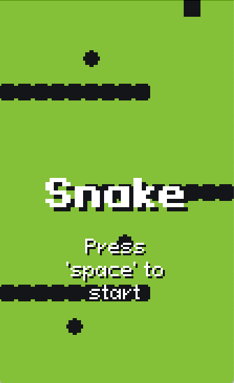
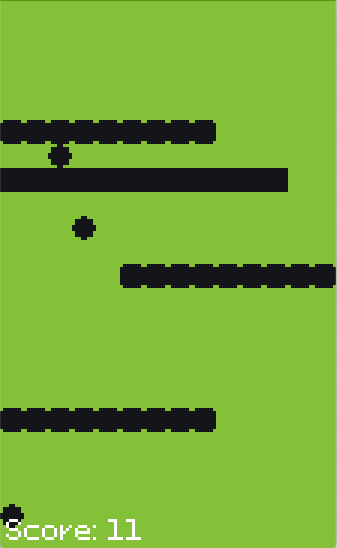

# Snake

| Title Screen | Gameplay |
| ----- | ----- |
|  |  |

This game is a classic implementation of the original Snake game. Navigate the snake to collect food, which makes it grow longer, while avoiding collisions with the walls and its own tail. With simple yet addictive gameplay, this retro-style game offers a nostalgic challenge for players of all ages.

Implemented as support materials for a Royal Instituion workshops.

### Acknowledgements

- [Pixeloid](https://ggbot.itch.io/pixeloid-font)
- Pick Up Sound Effect by [u_2fbuaev0zn](https://pixabay.com/users/u_2fbuaev0zn-30247713/?utm_source=link-attribution&utm_medium=referral&utm_campaign=music&utm_content=121244) from [Pixabay](https://pixabay.com//?utm_source=link-attribution&utm_medium=referral&utm_campaign=music&utm_content=121244)
- Hit Sound Effect from [Pixabay](https://pixabay.com/?utm_source=link-attribution&utm_medium=referral&utm_campaign=music&utm_content=95847)
